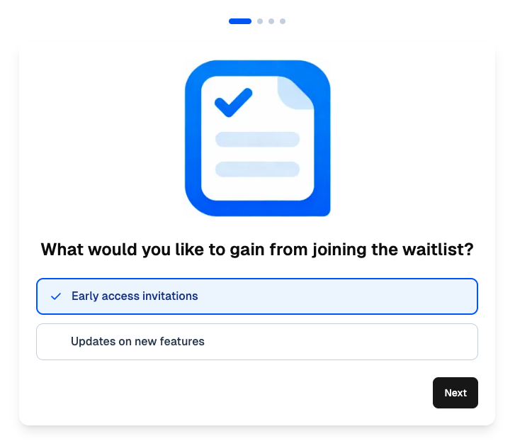
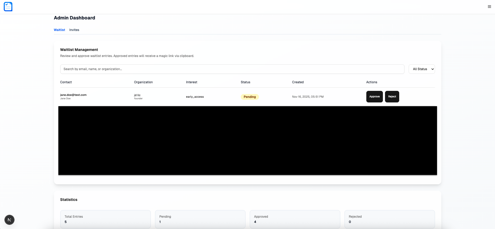

# Waitlist Magic Link Admin

**Complete passwordless authentication and waitlist management system with embeddable widget.**

[]()
[]()
[]()
[]()
[]()

---

## Screenshots

### Waitlist


### Waitlist Management


---

## Overview

A complete, self-contained authentication and waitlist system with magic links, admin dashboard, and embeddable widgets.

- 🔐 **Magic Link Authentication** - Passwordless authentication with HMAC-signed tokens
- 📝 **Multi-Step Waitlist Form** - 5-step carousel with client-side validation
- 🎨 **Embeddable Widget** - CSP frame-ancestors security for iframe embedding
- 👥 **Admin Dashboard** - Manage waitlist entries and invitations
- 🔑 **RBAC System** - Role-based access control (Admin/User)
- ✅ **Self-Contained** - Complete full-stack solution ready to deploy
- 🚀 **Backend API Included** - Ready-to-deploy with Supabase integration
- 🔒 **Secure** - CSRF protection, rate limiting, and input validation

---

## Quick Start

```bash
# 1. Clone/copy to your deployment location
cd waitlist-magic-link-admin

# 2. Install dependencies
npm install

# 3. Generate JWT keys for session management
openssl genrsa -out jwt-private.pem 2048
openssl rsa -in jwt-private.pem -pubout -out jwt-public.pem

# 4. Configure environment variables
cat > .env.local <<EOF
# Authentication
TOKEN_PEPPER=$(openssl rand -base64 32)
JWT_PRIVATE_KEY="$(cat jwt-private.pem)"
JWT_PUBLIC_KEY="$(cat jwt-public.pem)"

# Application
NEXT_PUBLIC_APP_URL=https://your-domain.com

# Database
SUPABASE_URL=https://xxx.supabase.co
SUPABASE_KEY=your-service-role-key

# Embedding (optional)
ALLOWED_EMBED_ORIGINS=https://yoursite.com,https://marketing.yoursite.com

# Email (optional)
SMTP_HOST=smtp.zoho.com
SMTP_PORT=465
SMTP_USER=your-email@domain.com
SMTP_PASS=your-password
SMTP_FROM=noreply@domain.com
EOF

# 5. Set up database schema (see Database Schema section)

# 6. Build and deploy
npm run build
npm run start

# 7. Access your application:
# Waitlist: https://your-domain.com/waitlist
# Embedded: https://your-domain.com/embed/waitlist
# Admin: https://your-domain.com/admin/waitlist
```

---

## Features

### 🔐 Magic Link Authentication

- **HMAC-Signed Tokens**: Secure token generation with configurable pepper
- **URL-Safe Slugs**: Clean, shareable invitation links
- **Single-Use Protection**: Atomic consumption prevents race conditions
- **Expiration Control**: Configurable token expiry and max uses
- **JWT Sessions**: RSA-2048 signed session tokens with HTTP-only cookies

### 📝 Waitlist Management

- **Multi-Step Form**: 5-step carousel with validation
- **Email Confirmation**: Automatic confirmation emails on submission
- **Admin Approval**: Review and approve waitlist entries
- **Automatic Invites**: Generate magic links after approval
- **Status Tracking**: Pending, approved, rejected states

### 👥 Admin Dashboard

- **Waitlist Admin**: Review, approve, and reject entries with filtering
- **Invite Management**: Create, revoke, and resend invitations
- **User Onboarding**: Automatic organization and user creation
- **Session Management**: Secure JWT-based authentication

### 🔒 Security Features

- **CSRF Protection**: Origin-based validation
- **Rate Limiting**: Built-in request throttling
- **RBAC**: Role hierarchy with permission checking
- **Audit Logging**: Track invite usage and user creation
- **Input Validation**: Client-side and server-side validation

---

## Table of Contents

1. [File Inventory](#1-file-inventory)
2. [Dependencies](#2-dependencies)
3. [Integration Guide](#3-integration-guide)
4. [Database Schema](#4-database-schema)
5. [Configuration](#5-configuration)
6. [Deployment](#6-deployment)
7. [Summary](#7-summary)

---

## 1. File Inventory

```
waitlist-magic-link-admin/                            (56 TypeScript files)
├── app/
│   ├── layout.tsx                               # Root layout with fonts
│   ├── globals.css                              # Global styles and Tailwind v4
│   ├── page.tsx                                 # Home page
│   │
│   ├── waitlist/
│   │   └── page.tsx                             # Standalone waitlist page
│   ├── embed/
│   │   └── waitlist/
│   │       └── page.tsx                         # Embeddable waitlist (iframe)
│   │
│   ├── magic-link/
│   │   └── accept/
│   │       └── [slug]/
│   │           └── page.tsx                     # Accept invite page
│   │
│   ├── admin/
│   │   ├── layout.tsx                           # Admin layout
│   │   ├── page.tsx                             # Admin dashboard
│   │   ├── waitlist/
│   │   │   └── page.tsx                         # Waitlist admin page
│   │   └── invites/
│   │       └── page.tsx                         # Invites admin page
│   │
│   └── api/
│       ├── magic-link/
│       │   └── [...path]/
│       │       └── route.ts                     # Main magic link API handler
│       └── waitlist/
│           └── join/
│               └── route.ts                     # Waitlist API endpoint
│
├── components/
│   ├── accept/
│   │   └── accept-page.tsx                      # Invite acceptance UI
│   ├── admin/
│   │   ├── invites-admin.tsx                    # Invites management UI
│   │   └── waitlist-admin.tsx                   # Waitlist management UI
│   ├── waitlist/
│   │   └── waitlist-carousel.tsx                # Multi-step form component
│   ├── layout/
│   │   └── page-container.tsx                   # Page layout wrapper
│   ├── providers/
│   │   └── auth-provider.tsx                    # Auth context provider
│   └── ui/                                      # shadcn/ui components (10 files)
│       ├── card.tsx
│       ├── button.tsx
│       ├── badge.tsx
│       ├── input.tsx
│       ├── label.tsx
│       ├── sheet.tsx
│       ├── alert-dialog.tsx
│       ├── logout-confirmation.tsx
│       └── app-header.tsx
│
├── lib/
│   ├── admin/
│   │   ├── magic-link-auth.ts                   # Main export & orchestration
│   │   └── constants.ts                         # Module constants
│   │
│   ├── types/
│   │   ├── index.ts                             # Core type definitions
│   │   └── events.ts                            # Event system types
│   │
│   ├── config/
│   │   ├── index.ts                             # Configuration interfaces
│   │   └── defaults.ts                          # Default configuration
│   │
│   ├── client/
│   │   ├── admin-api.ts                         # Client API wrappers
│   │   ├── ui-utils.ts                          # UI utility functions
│   │   └── use-close-on-orientation-change.ts   # Orientation hook
│   │
│   ├── crypto/
│   │   └── token.ts                             # Token generation & HMAC
│   │
│   ├── db/
│   │   ├── client.ts                            # Supabase client
│   │   └── supabase-adapter.ts                  # Database adapter
│   │
│   ├── invites/
│   │   └── manager.ts                           # Invite management
│   │
│   ├── onboarding/
│   │   └── manager.ts                           # Org/user creation
│   │
│   ├── rate-limit/
│   │   └── limiter.ts                           # Rate limiting
│   │
│   ├── rbac/
│   │   ├── permissions.ts                       # Permission checking
│   │   └── roles.ts                             # Role hierarchy
│   │
│   ├── security/
│   │   └── csrf.ts                              # CSRF validation
│   │
│   ├── waitlist/
│   │   ├── manager.ts                           # Waitlist business logic
│   │   └── constants.ts                         # Waitlist constants
│   │
│   ├── api/
│   │   └── handlers/
│   │       ├── accept.ts                        # Accept invite handler
│   │       ├── admin.ts                         # Admin operations
│   │       └── waitlist.ts                      # Waitlist join handler
│   │
│   ├── server/
│   │   ├── email.ts                             # SMTP email sending
│   │   ├── email-templates.ts                   # Email HTML templates
│   │   └── session-auth.ts                      # JWT session management
│   │
│   ├── utils/
│   │   ├── constants.ts                         # Shared constants
│   │   ├── fetch.ts                             # Retry logic
│   │   ├── validation.ts                        # Email validation
│   │   └── date-formatting.ts                   # Date formatting
│   │
│   └── events/
│       └── emitter.ts                           # Event emitter
│
├── package.json                                 # Dependencies
├── tsconfig.json                                # TypeScript config
├── postcss.config.mjs                           # PostCSS/Tailwind v4 config
└── README.md                                    # This file
```

### Key Components

**app/waitlist/page.tsx**
- Standalone waitlist page with full layout
- Route: `/waitlist`
- Features: Full page layout, responsive design

**app/embed/waitlist/page.tsx**
- Embeddable waitlist for iframe integration
- Route: `/embed/waitlist`
- Features: CSP protection, minimal chrome, analytics integration

**app/magic-link/accept/[slug]/page.tsx**
- Magic link acceptance flow
- Route: `/magic-link/accept/[slug]`
- Features: Token validation, session creation, user onboarding

**app/admin/waitlist/page.tsx**
- Admin dashboard for waitlist management
- Route: `/admin/waitlist`
- Features: Approve/reject entries, filtering, search

**app/admin/invites/page.tsx**
- Admin dashboard for invitation management
- Route: `/admin/invites`
- Features: Create, revoke, resend invites

---

## 2. Dependencies

### 2.1 NPM Packages Required

```json
{
  "dependencies": {
    "@radix-ui/react-dialog": "^1.1.15",
    "@radix-ui/react-label": "^2.1.8",
    "@radix-ui/react-slot": "^1.2.4",
    "@supabase/supabase-js": "^2.39.0",
    "class-variance-authority": "^0.7.1",
    "clsx": "^2.1.1",
    "geist": "^1.5.1",
    "jsonwebtoken": "^9.0.0",
    "lucide-react": "^0.263.1",
    "next": "^15.5.4",
    "nodemailer": "^6.9.0",
    "react": "^19.0.0",
    "react-dom": "^19.0.0",
    "tailwind-merge": "^3.4.0"
  },
  "devDependencies": {
    "@tailwindcss/postcss": "^4.1.9",
    "@types/jsonwebtoken": "^9.0.0",
    "@types/node": "^20.0.0",
    "@types/nodemailer": "^6.4.14",
    "@types/react": "^18.2.0",
    "@types/react-dom": "^18.2.0",
    "tailwindcss": "^4.1.9",
    "typescript": "^5.9.3"
  }
}
```

### 2.2 External Services

**Required**:
- **Supabase**: Database for storing invites, waitlist, users, and organizations
  - Free tier available
  - Requires multiple tables (see Database Schema section)

**Optional**:
- **SMTP Server**: For sending magic link and confirmation emails
  - Works with Gmail, Zoho, SendGrid, etc.
  - System works without email but loses notification capabilities

---

## 3. Integration Guide

### 3.1 Setup Steps

1. **Install dependencies**:
   ```bash
   npm install
   ```

2. **Generate JWT keys**:
   ```bash
   openssl genrsa -out jwt-private.pem 2048
   openssl rsa -in jwt-private.pem -pubout -out jwt-public.pem
   ```

3. **Configure TypeScript** (`tsconfig.json` already included):
   ```json
   {
     "compilerOptions": {
       "baseUrl": ".",
       "paths": {
         "@/*": ["./*"]
       }
     }
   }
   ```

4. **Set environment variables** (`.env.local`):
   ```bash
   # Required
   TOKEN_PEPPER=$(openssl rand -base64 32)
   JWT_PRIVATE_KEY="$(cat jwt-private.pem)"
   JWT_PUBLIC_KEY="$(cat jwt-public.pem)"
   NEXT_PUBLIC_APP_URL=https://your-domain.com
   SUPABASE_URL=https://xxx.supabase.co
   SUPABASE_KEY=your-service-role-key

   # Optional: Allow embedding on specific domains
   ALLOWED_EMBED_ORIGINS=https://marketing-site.com,https://landing.com

   # Optional: SMTP for emails
   SMTP_HOST=smtp.zoho.com
   SMTP_PORT=465
   SMTP_USER=noreply@yourdomain.com
   SMTP_PASS=your-password
   SMTP_FROM=noreply@yourdomain.com
   ```

5. **Set up database** (see Database Schema section below)

6. **Build and deploy**:
   ```bash
   npm run build
   npm run start
   ```

### 3.2 Embedding the Waitlist Widget

```html
<!-- On your marketing site -->
<iframe
  src="https://your-app.com/embed/waitlist"
  width="100%"
  height="700"
  frameborder="0"
  style="border: none; max-width: 800px;"
  allow="analytics"
></iframe>
```

### 3.3 Security Configuration

**CSP frame-ancestors** protection is configured via `ALLOWED_EMBED_ORIGINS`:

```bash
# Production: Allow specific domains to embed
ALLOWED_EMBED_ORIGINS=https://example.com,https://marketing.example.com

# Development: Allow all origins (not recommended for production)
# Leave empty or omit the variable
```

---

## 4. Database Schema

### Required Tables

**core.invites**
- Stores magic link invitation records
- Columns: invite_id, email, token_hash, url_slug, expires_at, status, etc.

**core.waitlist**
- Stores waitlist registration submissions
- Columns: waitlist_id, email, first_name, last_name, status, etc.

**core.organizations**
- Organization/tenant records
- Columns: org_id, org_name, onboarding_type_id, etc.

**core.organizations_users**
- User accounts linked to organizations
- Columns: user_id, org_id, email, role_id, etc.

**core.onboarding_types**
- Tracks onboarding methods
- Columns: onboarding_type_id, name (e.g., 'Magic Link')

### Required Functions

**funcs.consume_invite()**
- Atomic single-use invite consumption (race-condition safe)
- Parameters: p_slug, p_token_hash, p_ua_hash, p_ip_prefix
- Returns consumed invite or error

### Environment Variables for Database

```bash
SUPABASE_URL=https://xxx.supabase.co
SUPABASE_KEY=your-service-role-key  # Service role key, not anon key
```

**Note**: Database migration SQL files are not included. You'll need to create the schema based on the table structures listed above.

---

## 5. Configuration

### 5.1 Environment Variables

| Variable | Required | Description | Example |
|----------|----------|-------------|---------|
| `TOKEN_PEPPER` | Yes | HMAC secret for magic link tokens | `openssl rand -base64 32` |
| `JWT_PRIVATE_KEY` | Yes | RSA private key for signing sessions | PEM format RSA-2048 key |
| `JWT_PUBLIC_KEY` | Yes | RSA public key for verifying sessions | PEM format public key |
| `NEXT_PUBLIC_APP_URL` | Yes | Application base URL | `https://app.example.com` |
| `SUPABASE_URL` | Yes | Supabase project URL | `https://xxx.supabase.co` |
| `SUPABASE_KEY` | Yes | Supabase service role key | `eyJhbGc...` |
| `ALLOWED_EMBED_ORIGINS` | No | Domains allowed to embed | `https://site1.com,https://site2.com` |
| `SMTP_HOST` | No | SMTP server hostname | `smtp.zoho.com` |
| `SMTP_PORT` | No | SMTP server port | `465` (SSL) or `587` (TLS) |
| `SMTP_USER` | No | SMTP username/email | `noreply@example.com` |
| `SMTP_PASS` | No | SMTP password | `your-password` |
| `SMTP_FROM` | No | From email address | `noreply@example.com` |

### 5.2 Customization

**Branding**:
- Update logo in `/public/logo.webp`
- Modify email templates in `lib/server/email.ts` and `lib/server/email-templates.ts`
- Update colors and styling in component files

**Cookie Name**:
- Update `COOKIE_NAME.SESSION` in `lib/utils/constants.ts` (currently `'app_session'`)

**Google Analytics** (optional):
- Update tracking ID in `app/embed/waitlist/page.tsx`
- Current placeholder: `G-GABCD1234`

---

## 6. Deployment

### Option 1: Vercel (Recommended)

```bash
# Install Vercel CLI
npm i -g vercel

# Deploy
vercel

# Set environment variables in Vercel dashboard
# Add all required env vars from section 5.1
```

### Option 2: Docker

```dockerfile
FROM node:20-alpine

WORKDIR /app

COPY package*.json ./
RUN npm ci --only=production

COPY . .
RUN npm run build

EXPOSE 3000

CMD ["npm", "start"]
```

```bash
docker build -t waitlist-magic-link-admin .
docker run -p 3000:3000 --env-file .env waitlist-magic-link-admin
```

### Option 3: Self-Hosted

```bash
# Build
npm run build

# Start production server
npm run start

# Use PM2 for process management (optional)
npm install -g pm2
pm2 start npm --name "waitlist-admin" -- start
```

---

## 7. Summary

**Status**: ✅ **Production Ready** - Complete authentication and waitlist system

**Last Updated**: 2025-11-16

**What's Included**:
- ✅ Magic link authentication with JWT sessions
- ✅ Multi-step waitlist form with validation
- ✅ Embeddable waitlist widget (`/embed/waitlist`)
- ✅ Standalone waitlist page (`/waitlist`)
- ✅ Admin dashboard for waitlist management
- ✅ Admin dashboard for invite management
- ✅ Backend API endpoints with CSRF protection
- ✅ Supabase database adapter
- ✅ Role-based access control (RBAC)
- ✅ Email integration (magic links + confirmations)
- ✅ Rate limiting and security validation
- ✅ User onboarding with organization creation
- ✅ All UI components (shadcn/ui based)
- ✅ Shared utilities (validation, date formatting, retry logic)

**Technology Stack**:
- **Frontend**: Next.js 15.5, React 19, TypeScript 5.9
- **Backend**: Next.js API Routes
- **Database**: Supabase (PostgreSQL)
- **Email**: Nodemailer (optional)
- **Styling**: Tailwind CSS 4.1
- **Auth**: JWT (RSA-2048), HMAC-SHA256

**Deployment Requirements**:
1. Node.js 20+ runtime
2. Supabase account (free tier works)
3. RSA key pair for JWT signing
4. SMTP server (optional, for emails)

**Next Steps**:
1. Set up Supabase project and create required tables
2. Generate JWT keys and TOKEN_PEPPER
3. Configure environment variables
4. Customize branding (logo, colors, email templates)
5. Deploy to your preferred platform
6. Embed waitlist widget on marketing site (optional)

---

## License

This project is licensed under the MIT License - see the [LICENSE](LICENSE) file for details.

---

**End of Documentation**
